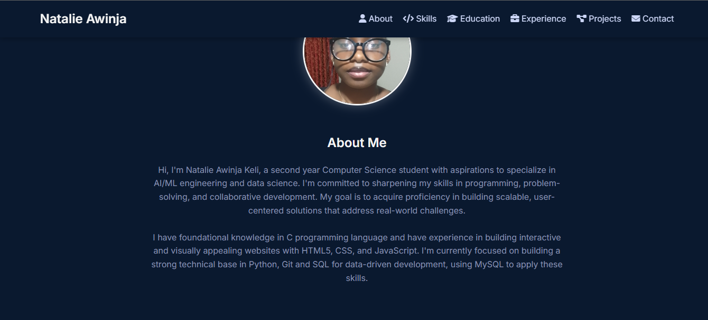
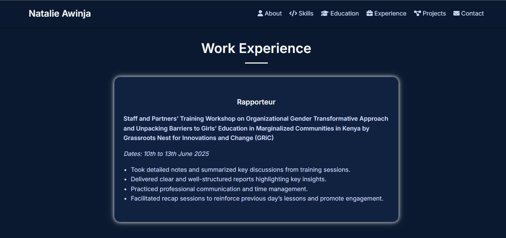

# My Developer Portfolio

This is my first personal developer portfolio built using **HTML** and **CSS**. It showcases who I am, my educational background, skills, interests, certifications and the projects I have created so far.






## 🌟 Features

- **Responsive layout:** Ensures a seamless viewing experience across various devices (desktops, tablets, and mobile phones).
- **Project showcase with clickable links:** Easily navigate to and explore my individual projects.
- **Downloadable CV:** Convenient for recruiters and hiring managers to quickly access my resume.
- **Contact form:** Demonstrates form structure and design whic is functional as well.
- **Clean and modern visual design:** Built with attention to detail for optimal performance and customizability.

## 📁 Project Structure

portfolio/
├── index.html                                
├── style.css  
├── script.js
├── media/                     
├── kcse_certification.pdf      
├── natalie_CV_final.pdf        
├── LICENSE                     
└── README.md                                   


## 🚀 Technologies Used

- HTML5
- CSS3
- JavaScript
- Git & GitHub

## 🔗 Live Demo

[View Portfolio Website](https://keli281.github.io/my-portfolio/)  

## 📂 How to View Locally

1.  Clone the repository:
    ```bash
    git clone https://github.com/Keli281/my-portfolio.git
    ```
2.  Navigate into the repository directory:
    ```bash
    cd my-portfolio
    ```
3.  Open `index.html` in any web browser.

## ✨ My Projects

Here are some of my projects that are featured in this portfolio, with direct links to their respective GitHub repositories:

* **Website Portfolio for my first client:** A static Portfolio Website that showcases their education and achievements with a functional contact form and a downloadable CV.
    * [GitHub Repository for portfolio](https://github.com/Keli281/my-clients-portfolio)
    

## ✨ Future Enhancements

- Implement full functionality for the contact form with a backend service (e.g., Node.js, Python Flask).
- Integrate JavaScript Frameworks for more interactive elements and dynamic content.
- Add more projects showcasing new skills (e.g., API integration, full-stack development).

## 📄 License

This project is licensed under the MIT License - see the [LICENSE](LICENSE) file for details.


## 🧠 Author
Natalie Awinja
Computer Science Student, Multimedia University of Kenya
GitHub: @Keli281
