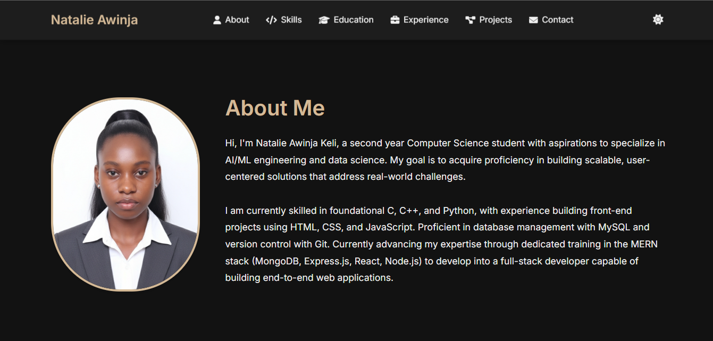
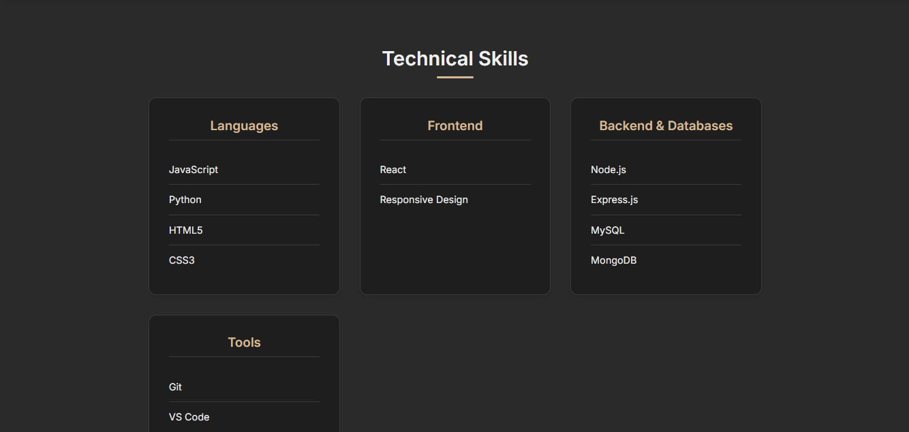
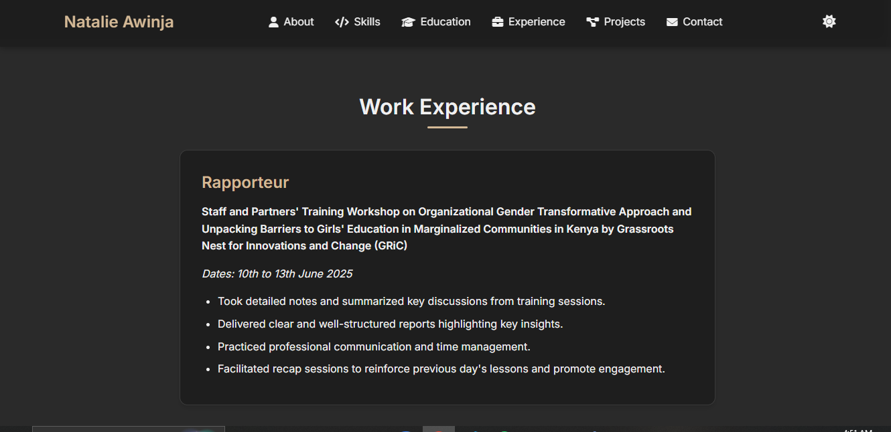

# My Developer Portfolio

This is my first personal developer portfolio built using **HTML** **CSS** and **JavaScript**. It showcases who I am, my educational background, skills, interests, certifications and the projects I have created so far.

## 🌟 Features

- **Responsive layout:** Ensures a seamless viewing experience across various devices (desktops, tablets, and mobile phones).
- **Project showcase with clickable links:** Easily navigate to and explore my individual projects.
- **Downloadable CV:** Convenient for recruiters and hiring managers to quickly access my resume.
- **Contact form:** Demonstrates form structure and design which is functional as well.
- **Clean and modern visual design:** Built with attention to detail for optimal performance and customizability.                                   

## 🚀 Technologies Used

- HTML5
- CSS3
- JavaScript
- Git & GitHub

## 🔗 Live Demo

[View Portfolio Website](https://natalie-awinja.vercel.app/)  

##  License
MIT License

##  Author
Natalie Awinja
Computer Science Student, Multimedia University of Kenya
GitHub: @Keli281
